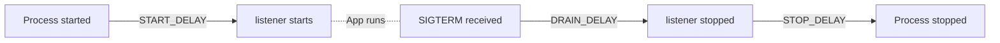
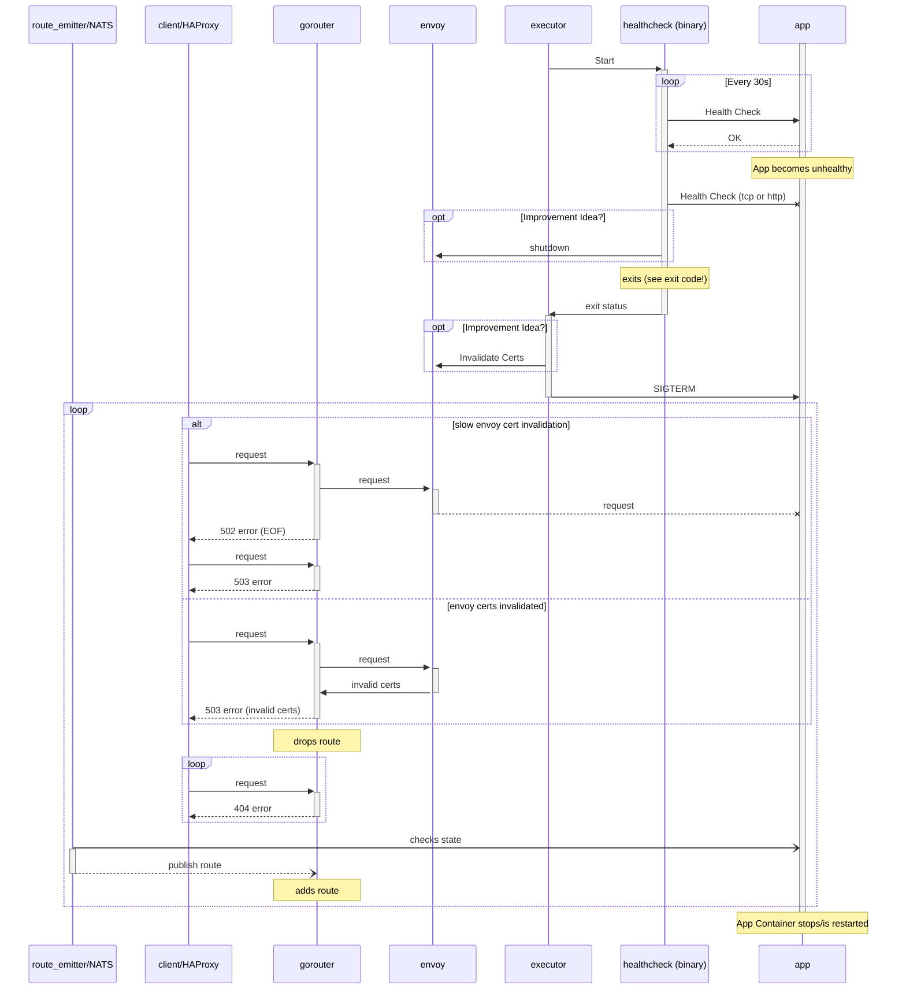

# go-tcp-test
Test app for Cloud Foundry app lifecycle & health check debugging.


## What it does
The app offers various endpoints that allow for fine control over its health state & responses on TCP level.

It also logs every request it receives, plus various lifecycle events.

### `/togglehealth`:
Toggles App Health State and returns new app health state.
### `/health`:
Returns a `200` if the app is healthy, drops/closes the connection otherwise.   

### `/drop`:
Always drops the Connection. Results in Gorouter error-code `502` with `x_cf_routererror:"endpoint_failure (EOF (via idempotent request))"`.

### `/always_up`:
Always returns a `200` response even when the app is unhealthy.

### All others
Returns a `200` if the app is healthy, drops/closes the connection otherwise.
Also writes the HTTP Method into the response

## How to build
```
go build
```

## How to run
Either run the binary or push it to CloudFoundry with the given `manifest.yml`.

Use `health-check-type: process` for [process healthchecks](https://docs.cloudfoundry.org/devguide/deploy-apps/healthchecks.html#types), or the following for HTTP health checks:
```yaml
    health-check-type: http
    health-check-http-endpoint: /health
```

The following environment variables affect the apps behaviour and can be specified in the manifest (see example).


### `INITIAL_HEALTH`
If `INITIAL_HEALTH: false` is specified, the app will start with failing Health endpoint (i.e. `cf push` will fail)

### Customizable Wait Periods 



`START_DELAY`, `DRAIN_DELAY` and `STOP_DELAY` can be set to durations, e.g. "10s", "5m".

## How to use
After pushing the app to CF, use `cf logs go-tcp-test` to see the detailed log output of every request/health-check/event.
## References
- [Health Check Lifecycle in CF Docs](https://docs.cloudfoundry.org/devguide/deploy-apps/healthchecks.html#healthcheck-lifecycle)

## App Lifecycle (WIP)


### App Crash: 


